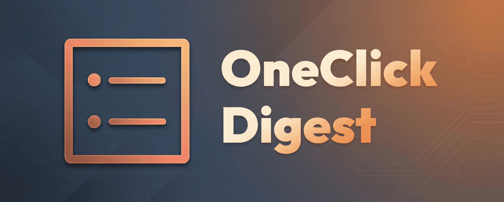
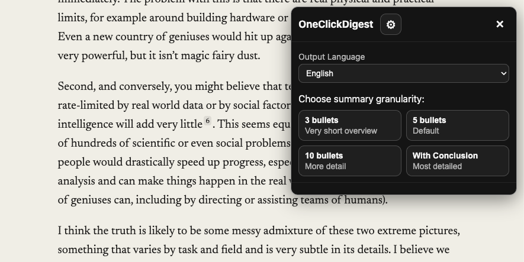
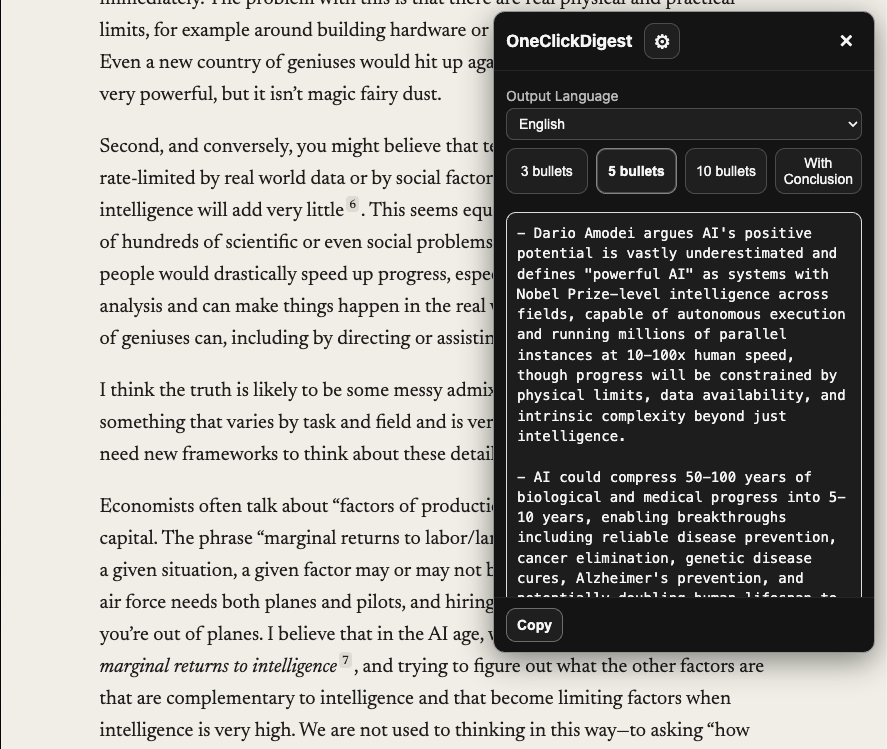

<div align="center">
  
  <br /><br />
  <b>• OneClickDigest : Article Summarizer for Chrome / Brave •</b>
  <p>A browser extension that summarizes web articles with one click using your Claude API key.</p>
  <p><b>🔑 Your API key is stored locally on your device and never sent anywhere except directly to Anthropic.</b></p>
  <br />
  
  <br />
  
</div>

## Quick Start

### 1. Download the Extension

Download the latest ZIP from [Releases](../../releases) and unzip it.

### 2. Install in Your Browser

**Chrome:**

1. Open `chrome://extensions`
2. Enable **Developer mode** (top right)
3. Click **Load unpacked**
4. Select the `dist/` folder

**Brave:**

1. Open `brave://extensions`
2. Enable **Developer mode**
3. Click **Load unpacked**
4. Select the `dist/` folder

### 3. Get a Claude API Key

1. Go to [Anthropic Console](https://console.anthropic.com/)
2. Create an account or sign in
3. Open **API keys** from the left menu
4. Create a new key and save it securely

> **Note:** API usage may require billing setup. Never share your API key publicly.

### 4. Configure the Extension

1. Click the OneClickDigest icon in the toolbar
2. Click the gear icon to open Settings
3. Paste your API key and click **Save**

### 5. Start Using

1. Open an article page you want to summarize
2. Click the OneClickDigest icon
3. Choose a summary mode (3 / 5 / 10 bullets or With Conclusion)
4. Click **Copy** to copy the summary to your clipboard

## Features

| Feature | Description |
|---------|-------------|
| **4 Summary Modes** | 3, 5, or 10 bullet points, or summary with conclusion |
| **Cost Estimation** | Shows character count, tokens, estimated cost, and time before running |
| **Long Article Support** | Automatic chunked map-reduce summarization for lengthy content |
| **Multi-language** | Output language can be set independently from UI language |
| **Progress & Cancel** | Progress indicator with cancel option during summarization |

## Troubleshooting

### "This page does not look like a normal article"

The extractor couldn't find article content. This happens on dashboards, feeds, or dynamic pages. Try scrolling to load all content, then retry.

### API Errors / Timeouts

- Wait and retry
- Check your API key and billing status at [Anthropic Console](https://console.anthropic.com/)
- Switch to a shorter summary mode to reduce cost and latency

### Nothing Happens When I Click the Icon

- Verify the extension is enabled
- Some pages (Chrome Web Store, browser internal pages) don't allow extensions

## Privacy

When summarizing, the extension sends to the Claude API:

- Page title
- Page URL
- Extracted article text

Your API key is stored locally and only sent to Anthropic for API calls. Do not use on content you don't want sent to a third-party API.

## Development

### Build from Source

```bash
git clone https://github.com/your-repo/one-click-digest.git
cd one-click-digest
npm install
npm run build
npm test
```

Load the `dist/` folder in your browser.

### Advanced Options

The settings page offers additional configuration:

- Models for map / reduce / repair passes
- Prompt caching (TTL)
- Cost limits and extraction limits

## License

MIT License - See [LICENSE](LICENSE)

Third-party components (e.g., Mozilla Readability) are listed in [THIRD_PARTY_NOTICES.md](THIRD_PARTY_NOTICES.md)

---

<div align="center">
  <sub>This project is not affiliated with or endorsed by Anthropic. Claude is a product of Anthropic.</sub>
</div>
