# UI状態遷移図（State Machine）v1.1-UX

対象: 右上オーバーレイパネル（Content Script内）  
前提: v1.1-UX 設計（MV3 / 4モード / Token見積 / 承認 / 全文分割 / $1.00上限 / フル再実行）

---

## 1. 状態一覧（UI状態）

| State ID | 表示名 | 概要 | ユーザー操作 |
|---|---|---|---|
| `CLOSED` | 閉 | パネル非表示 | アイコンクリックでOPEN |
| `IDLE` | モード選択 | 4モードボタン、言語、設定導線 | モード選択、言語変更、閉じる |
| `EXTRACTING` | 解析中 | DOM→本文抽出（Readability等） | キャンセル、閉じる（確認あり） |
| `PREFLIGHT_ESTIMATE` | 見積（概算） | 文字数ベースの概算を表示 | キャンセル、閉じる（確認あり） |
| `PREFLIGHT_REFINING` | 見積（精密化） | count_tokens成功時のみ数値を更新 | キャンセル、閉じる（確認あり） |
| `CONFIRMING` | 承認待ち | 文字数/トークン/コスト/時間を表示し承認 | 実行/軽量モード/キャンセル/閉じる |
| `BLOCKED_HARD_LIMIT` | 実行不可 | 推定が$1超等でブロック | モード変更、言語変更、閉じる |
| `SUMMARIZING_MAP` | 要約中（分割） | chunk 1..n の要約 | キャンセル、閉じる（確認あり） |
| `SUMMARIZING_REDUCE` | 要約中（統合） | reduce1（最終要約生成） | キャンセル、閉じる（確認あり） |
| `SUMMARIZING_REPAIR` | 形式修正 | reduce2（フォーマット修正） | キャンセル、閉じる（確認あり） |
| `DONE` | 完了 | 要約表示 + Copy | Copy、閉じる、（モード/言語変更→フル再実行） |
| `CANCELLED` | キャンセル済 | ユーザーが中断した結果 | モード再選択、閉じる |
| `ERROR` | エラー | 通信/抽出/認証等のエラー表示 | 再試行、設定を開く、閉じる |

---

## 2. イベント定義（トリガ）

### 2.1 ユーザー操作
- `EVT_OPEN_PANEL`：アイコンクリック/スクリプト注入後にパネル表示
- `EVT_CLOSE_CLICK`：×ボタン
- `EVT_CANCEL_CLICK`：キャンセルボタン
- `EVT_MODE_SELECT(mode)`：4モードのいずれかを選択（=開始）
- `EVT_LANGUAGE_CHANGE(lang)`：言語変更
- `EVT_APPROVE_RUN`：承認で実行
- `EVT_APPROVE_LIGHTWEIGHT`：承認で軽量モード（3行）に切替して実行
- `EVT_COPY`：Copyクリック
- `EVT_RETRY`：再試行
- `EVT_OPEN_OPTIONS`：設定画面を開く

### 2.2 内部イベント（非同期完了）
- `EVT_EXTRACT_OK(text, meta)`：本文抽出成功
- `EVT_EXTRACT_FAIL(reason)`：本文抽出失敗/不適
- `EVT_ESTIMATE_READY(roughEstimate)`：概算見積完了
- `EVT_COUNT_TOKENS_OK(refinedEstimate)`：count_tokens成功
- `EVT_COUNT_TOKENS_FAIL`：count_tokens失敗（表示は概算のまま継続）
- `EVT_CONFIRM_REQUIRED`：承認が必要
- `EVT_CONFIRM_NOT_REQUIRED`：承認不要（自動で要約へ）
- `EVT_HARD_LIMIT_BLOCKED`：$1.00超過などでブロック
- `EVT_SUMMARY_MAP_PROGRESS(i,n)`：map進捗
- `EVT_SUMMARY_MAP_DONE(chunkSummaries)`：map完了
- `EVT_SUMMARY_REDUCE_DONE(markdown)`：reduce1完了
- `EVT_FORMAT_INVALID`：フォーマット検証NG
- `EVT_SUMMARY_REPAIR_DONE(markdown)`：reduce2完了
- `EVT_SUMMARY_FAIL(error)`：要約失敗（通信/認証/レート等）
- `EVT_ABORTED`：AbortControllerにより中断確定

---

## 3. 状態遷移（Mermaid）

> Mermaid対応のMarkdownビューアでは図として表示されます。  
> 非対応環境でも「表（次章）」で同じ情報を追えます。

```mermaid
stateDiagram-v2
  [*] --> CLOSED

  CLOSED --> IDLE: EVT_OPEN_PANEL

  IDLE --> CLOSED: EVT_CLOSE_CLICK
  IDLE --> EXTRACTING: EVT_MODE_SELECT(mode)
  IDLE --> IDLE: EVT_LANGUAGE_CHANGE(lang)

  EXTRACTING --> PREFLIGHT_ESTIMATE: EVT_EXTRACT_OK
  EXTRACTING --> ERROR: EVT_EXTRACT_FAIL
  EXTRACTING --> CANCELLED: EVT_CANCEL_CLICK / EVT_ABORTED
  EXTRACTING --> CLOSED: EVT_CLOSE_CLICK (confirm->OK) / EVT_ABORTED

  PREFLIGHT_ESTIMATE --> PREFLIGHT_REFINING: EVT_ESTIMATE_READY (async count_tokens start)
  PREFLIGHT_ESTIMATE --> CONFIRMING: EVT_CONFIRM_REQUIRED
  PREFLIGHT_ESTIMATE --> SUMMARIZING_MAP: EVT_CONFIRM_NOT_REQUIRED (chunking)
  PREFLIGHT_ESTIMATE --> SUMMARIZING_REDUCE: EVT_CONFIRM_NOT_REQUIRED (single)
  PREFLIGHT_ESTIMATE --> BLOCKED_HARD_LIMIT: EVT_HARD_LIMIT_BLOCKED
  PREFLIGHT_ESTIMATE --> CANCELLED: EVT_CANCEL_CLICK / EVT_ABORTED
  PREFLIGHT_ESTIMATE --> CLOSED: EVT_CLOSE_CLICK (confirm->OK) / EVT_ABORTED

  PREFLIGHT_REFINING --> CONFIRMING: EVT_COUNT_TOKENS_OK + EVT_CONFIRM_REQUIRED
  PREFLIGHT_REFINING --> SUMMARIZING_MAP: EVT_COUNT_TOKENS_OK + EVT_CONFIRM_NOT_REQUIRED (chunking)
  PREFLIGHT_REFINING --> SUMMARIZING_REDUCE: EVT_COUNT_TOKENS_OK + EVT_CONFIRM_NOT_REQUIRED (single)
  PREFLIGHT_REFINING --> PREFLIGHT_ESTIMATE: EVT_COUNT_TOKENS_FAIL (fallback)
  PREFLIGHT_REFINING --> BLOCKED_HARD_LIMIT: EVT_HARD_LIMIT_BLOCKED
  PREFLIGHT_REFINING --> CANCELLED: EVT_CANCEL_CLICK / EVT_ABORTED
  PREFLIGHT_REFINING --> CLOSED: EVT_CLOSE_CLICK (confirm->OK) / EVT_ABORTED

  CONFIRMING --> BLOCKED_HARD_LIMIT: EVT_HARD_LIMIT_BLOCKED
  CONFIRMING --> SUMMARIZING_MAP: EVT_APPROVE_RUN (chunking)
  CONFIRMING --> SUMMARIZING_REDUCE: EVT_APPROVE_RUN (single)
  CONFIRMING --> EXTRACTING: EVT_APPROVE_LIGHTWEIGHT (mode=3lines) + restart
  CONFIRMING --> CANCELLED: EVT_CANCEL_CLICK
  CONFIRMING --> CLOSED: EVT_CLOSE_CLICK

  BLOCKED_HARD_LIMIT --> EXTRACTING: EVT_MODE_SELECT(mode) (restart)
  BLOCKED_HARD_LIMIT --> IDLE: EVT_LANGUAGE_CHANGE(lang)
  BLOCKED_HARD_LIMIT --> CLOSED: EVT_CLOSE_CLICK

  SUMMARIZING_MAP --> SUMMARIZING_MAP: EVT_SUMMARY_MAP_PROGRESS(i,n)
  SUMMARIZING_MAP --> SUMMARIZING_REDUCE: EVT_SUMMARY_MAP_DONE
  SUMMARIZING_MAP --> ERROR: EVT_SUMMARY_FAIL
  SUMMARIZING_MAP --> CANCELLED: EVT_CANCEL_CLICK / EVT_ABORTED
  SUMMARIZING_MAP --> CLOSED: EVT_CLOSE_CLICK (confirm->OK) / EVT_ABORTED

  SUMMARIZING_REDUCE --> DONE: EVT_SUMMARY_REDUCE_DONE + format ok
  SUMMARIZING_REDUCE --> SUMMARIZING_REPAIR: EVT_FORMAT_INVALID
  SUMMARIZING_REDUCE --> ERROR: EVT_SUMMARY_FAIL
  SUMMARIZING_REDUCE --> CANCELLED: EVT_CANCEL_CLICK / EVT_ABORTED
  SUMMARIZING_REDUCE --> CLOSED: EVT_CLOSE_CLICK (confirm->OK) / EVT_ABORTED

  SUMMARIZING_REPAIR --> DONE: EVT_SUMMARY_REPAIR_DONE
  SUMMARIZING_REPAIR --> ERROR: EVT_SUMMARY_FAIL
  SUMMARIZING_REPAIR --> CANCELLED: EVT_CANCEL_CLICK / EVT_ABORTED
  SUMMARIZING_REPAIR --> CLOSED: EVT_CLOSE_CLICK (confirm->OK) / EVT_ABORTED

  DONE --> IDLE: EVT_MODE_SELECT(mode) (full rerun)
  DONE --> IDLE: EVT_LANGUAGE_CHANGE(lang) (full rerun)
  DONE --> DONE: EVT_COPY
  DONE --> CLOSED: EVT_CLOSE_CLICK

  CANCELLED --> IDLE: EVT_MODE_SELECT(mode)
  CANCELLED --> CLOSED: EVT_CLOSE_CLICK

  ERROR --> EXTRACTING: EVT_RETRY (restart from extract)
  ERROR --> IDLE: EVT_MODE_SELECT(mode) (restart)
  ERROR --> CLOSED: EVT_CLOSE_CLICK
```

---

## 4. 遷移表（実装用・正規化）

### 4.1 “フル再実行”ポリシー（重要）
- **DONEでの `EVT_MODE_SELECT` / `EVT_LANGUAGE_CHANGE` は必ず `EXTRACTING` からやり直す**。  
  （前回結果を薄く残すのは「表示上の工夫」で、状態機械上は新Runとして再開始）

### 4.2 表（From × Event → To）
| From | Event | To | 備考 |
|---|---|---|---|
| `CLOSED` | `EVT_OPEN_PANEL` | `IDLE` | 注入成功後に表示 |
| `IDLE` | `EVT_MODE_SELECT` | `EXTRACTING` | クリック=開始 |
| `IDLE` | `EVT_LANGUAGE_CHANGE` | `IDLE` | 設定保持のみ |
| `EXTRACTING` | `EVT_EXTRACT_OK` | `PREFLIGHT_ESTIMATE` | まず概算へ |
| `EXTRACTING` | `EVT_EXTRACT_FAIL` | `ERROR` | 理由付き |
| `PREFLIGHT_ESTIMATE` | `EVT_ESTIMATE_READY` | `PREFLIGHT_REFINING` | count_tokens開始（非同期） |
| `PREFLIGHT_ESTIMATE` | `EVT_CONFIRM_REQUIRED` | `CONFIRMING` | しきい値超 |
| `PREFLIGHT_ESTIMATE` | `EVT_CONFIRM_NOT_REQUIRED` | `SUMMARIZING_*` | single/chunkingで分岐 |
| `PREFLIGHT_*` | `EVT_HARD_LIMIT_BLOCKED` | `BLOCKED_HARD_LIMIT` | $1.00超、reduce2含む |
| `PREFLIGHT_REFINING` | `EVT_COUNT_TOKENS_OK` | `CONFIRMING` or `SUMMARIZING_*` | 条件評価し再分岐 |
| `PREFLIGHT_REFINING` | `EVT_COUNT_TOKENS_FAIL` | `PREFLIGHT_ESTIMATE` | 概算のまま継続 |
| `CONFIRMING` | `EVT_APPROVE_RUN` | `SUMMARIZING_*` | single/chunking |
| `CONFIRMING` | `EVT_APPROVE_LIGHTWEIGHT` | `EXTRACTING` | mode=3linesへ切替→再開始 |
| `SUMMARIZING_MAP` | `EVT_SUMMARY_MAP_DONE` | `SUMMARIZING_REDUCE` | reduceへ |
| `SUMMARIZING_REDUCE` | `EVT_FORMAT_INVALID` | `SUMMARIZING_REPAIR` | reduce2 |
| `SUMMARIZING_REDUCE` | `EVT_SUMMARY_REDUCE_DONE` | `DONE` | format ok |
| `SUMMARIZING_REPAIR` | `EVT_SUMMARY_REPAIR_DONE` | `DONE` | 修正完了 |
| `SUMMARIZING_*` | `EVT_SUMMARY_FAIL` | `ERROR` | 通信/認証など |
| `ANY_RUNNING` | `EVT_CANCEL_CLICK` | `CANCELLED` | Abort→確定 |
| `DONE` | `EVT_COPY` | `DONE` | トースト表示 |
| `DONE` | `EVT_MODE_SELECT` | `EXTRACTING` | **フル再実行**（新Run） |
| `DONE` | `EVT_LANGUAGE_CHANGE` | `EXTRACTING` | **フル再実行**（新Run） |

---

## 5. 実装ノート（状態機械の落とし穴）

### 5.1 RunIDで“古い応答”を捨てる
- フル再実行やキャンセルがあるため、backgroundからの `RESULT/ERROR/PROGRESS` は **runId一致**のときだけ反映する。

### 5.2 Close（×）と Cancel の違い
- Closeは「UIを閉じる」だが、要約中はコスト発生の可能性があるため**確認→abort**が必要。
- そのため、実装上は `EVT_CLOSE_CLICK` のOK時に `EVT_CANCEL_CLICK` と同等のabortを走らせてよい。

### 5.3 PREFLIGHT_REFINING は“表示”ではなく“更新”
- 画面は概算のままでもよい。精密化が成功したら数字だけ更新し、必要なら `CONFIRMING` へ遷移させる。

### 5.4 BLOCKED_HARD_LIMIT は“詰み”にしない
- 必ず代替導線（短いモード）を示す。状態機械上も `EVT_MODE_SELECT` で再挑戦できるようにする。

---

## 6. 結論要約
- 本 state machine は「短い記事は迷わず、長い記事は納得して実行し、走っている間は中断でき、結果は気持ちよくコピーできる」UXを、実装に落とせる粒度で規定します。  
- 最重要ルールは **runId整合** と **DONEでのフル再実行（仕様固定）** の2点です。
